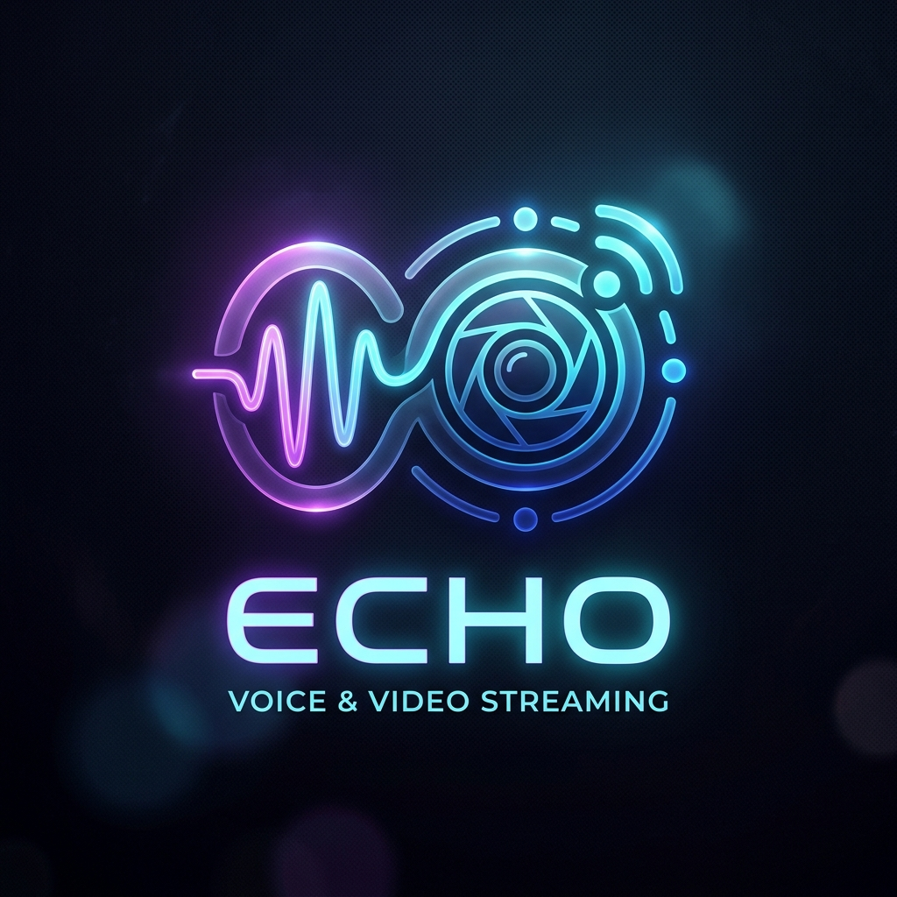

<p align="center">
  
</p>

<h1 align="center">Echo</h1>

<p align="center">
  <strong>A premium, self-hosted, neon-glassmorphic alternative to Discord and TeamSpeak.</strong><br />
  Built with React, Node.js, WebRTC, and SQL. Fully encrypted, customizable, and lightweight.
</p>

<p align="center">
  
  
  
  
</p>

---

## ✨ Features

### 📞 Real-Time Communications
- **WebRTC Voice Chat:** Low latency, high-quality audio utilizing the Opus codec.
- **Screen Sharing (Display Streaming):** Peer-to-peer screen sharing with automated WebRTC renegotiation.
- **Webcam Grid Stage:** Stream your camera and screen shares concurrently in a clean, responsive CSS video grid.
- **Relay Fallback (TURN):** Seamless fallback to TURN servers (e.g., Coturn) for users behind symmetric NATs or firewalls.

### 🎙️ Advanced Audio Processing & Filters
- **Noise Gate / Voice Threshold:** Calibrate microphone sensitivity to exclude breathing and background noise.
- **Acoustic Echo Cancellation (AEC):** Filter echo when utilizing speakers.
- **Automatic Gain Control (AGC):** Automatically normalize voice volume.
- **Keyboard High-Pass Filter (HPF):** Cut frequencies below 150 Hz to eliminate typing noise or fan hums.
- **Local Loopback (Self-Hearing):** Test your audio setup locally before joining rooms.

### 💬 Rich Text Chat & Image Compression
- **Direct Messages (DMs):** Persistent direct messaging, storing messages for offline users.
- **Channel Chats:** Clean chat views for specific rooms, grouping messages sent within a 5-minute window.
- **Client-Side Image Compression:** Attach images (`📎`) which are scaled and compressed to 60% quality JPEG in-browser (reducing files to 20-30KB) to protect server storage.

### 🎨 Fully Customizable UI
- **Glassmorphism Design:** Modern translucent panels, blur sliders, and corner rounding.
- **Dynamic Themes:** Pick presets (Cyberpunk, Dark Space, Emerald) or set custom backgrounds (URLs) and accent colors.
- **Layout Toggles:** Show/hide text chat and switch layout orientation (left/right sidebar) instantly.
- **Multi-Language (i18n):** Support for both **German (DE)** and **English (EN)** with automatic browser detection.

### 🛡️ Administration & Security
- **Role-Based Permissions:** Admin, Member, and Guest tiers.
- **Live Rights Manager:** Admins can promote/demote users and rename participants live.
- **Key-Based Authentication:** Passwordless key logins. No email registration required.
- **Mandatory E2EE:** Enforced DTLS key exchanges and SRTP media stream encryption.

---

## 🚀 Quick Start

Echo can be deployed locally using helper scripts or via Docker.

### Option A: Using Docker Compose (Recommended)
Make sure you have Docker and Docker Compose installed, then run:

```bash
docker compose up --build -d
```
Access the client at `http://localhost:3001`.

### Option B: Local Running (Development)
You can run the launcher scripts directly:

- **Linux / macOS:**
  ```bash
  chmod +x start.sh
  ./start.sh
  ```
- **Windows:**
  Double-click `start.bat` or run it via Command Prompt.

---

## 💾 Database Configuration
Echo uses **Knex** to support dual database configurations in `server/.env`:

1. **SQLite (Default):** Zero configuration, saves data to `server/echo.sqlite`.
   ```env
   DB_TYPE=sqlite
   ```
2. **MariaDB / MySQL:** Production-ready relational storage.
   ```env
   DB_TYPE=mariadb
   DB_HOST=127.0.0.1
   DB_PORT=3306
   DB_USER=echo_user
   DB_PASS=your_secure_password
   DB_NAME=echo_db
   ```

---

## 🛠️ Technology Stack
- **Frontend:** React, Vite, TypeScript, HSL Tailored Styling (Vanilla CSS), Web Audio API, WebRTC.
- **Backend:** Node.js, Express, Socket.io (Signaling & Text Chat), Knex.js.
- **Database:** SQLite (file-based) or MariaDB.

---

## 📄 License
This project is licensed under the MIT License. See the LICENSE file for details.
