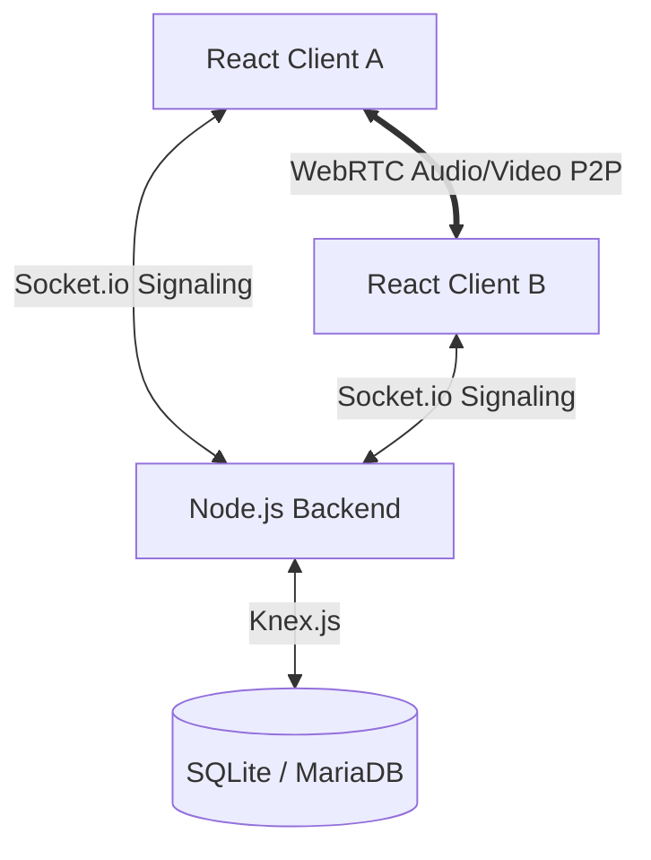

# Onboarding-Guide für ShirAsal

Herzlich willkommen im ShirAsal-Projekt! ShirAsal ist eine datenschutzfreundliche, selbst-hostbare, neon-glassmorphe Alternative zu Discord und TeamSpeak. Dieser Guide soll neuen Entwicklern helfen, die Architektur des Projekts zu verstehen, sich in der Codebase zurechtzufinden und die Entwicklungsumgebung einzurichten.

---

## 🏗️ System-Architektur

Das System besteht aus zwei Hauptkomponenten: einem **Node.js-Backend (Server)** und einem **React-Frontend (Client)**. 

Die Kommunikation findet über zwei Kanäle statt:
1. **WebSockets (Socket.io)**: Für Signalisierung (WebRTC Verbindungsaufbau), Text-Chat (Channel & DMs) und Echtzeit-Events (Rollen-Updates, Raumwechsel).
2. **WebRTC (Peer-to-Peer)**: Für die Übertragung von Sprache (Audio), Webcam-Video und Bildschirmfreigabe direkt zwischen den Clients.



---

## 📁 Projektstruktur & Dateischlüssel

Hier ist eine Übersicht über die wichtigsten Verzeichnisse und Dateien:

```text
├── client/                     # React Frontend (Vite + TypeScript)
│   ├── src/
│   │   ├── components/         # UI-Komponenten (Chat, Kanäle, Admin, Themes)
│   │   ├── contexts/           # Globale React Contexts (i18n Sprachsteuerung)
│   │   ├── hooks/              # Custom React Hooks (Zentral: WebRTC-Logik)
│   │   ├── utils/              # Hilfsfunktionen (z. B. RNNoise-Lader)
│   │   ├── App.tsx             # Zentraler Einstiegspunkt & State-Management
│   │   ├── index.css           # Globales Styling (Variables & CSS-Design-System)
│   │   └── App.css             # Lokale Styling-Utilitys
│   └── package.json
│
├── server/                     # Node.js Express Backend
│   ├── db.js                   # Knex-Datenbanklayer (SQLite/MariaDB support)
│   ├── index.js                # Socket.io Server, Express API, Auth-Endpunkte
│   └── package.json
│
├── .github/workflows/          # CI/CD (Docker-Image Auto-Build bei v* Tags)
├── Dockerfile                  # Multi-Stage Dockerfile für Client-Build & Server-Start
├── docker-compose.yml          # Container-Setup (Produktions- & Demo-Instanzen)
├── start.sh / start.bat        # Einfache Launcher für lokale Entwicklung
└── wails.json                  # Konfiguration für native Desktop-App (Wails)
```

---

## 🎙️ Detail-Erklärung der Kernkomponenten

### 1. WebRTC & Audio-Pipeline ([useWebRTC.ts](file:///home/bas_pit/Dokumente/Projekte/client/src/hooks/useWebRTC.ts))
Dies ist das Herzstück des Clients. Es kapselt:
- **RTCPeerConnection-Verwaltung**: Erstellt und verwaltet die P2P-Verbindungen zu allen anderen Teilnehmern im selben Sprachkanal.
- **Audio-Processing (Web Audio API)**:
  - Einbindung von Filtern: Acoustic Echo Cancellation (AEC), Automatic Gain Control (AGC), Noise Gate.
  - **Klangprofile (Equalizer & Compressor)**:
    - *Flat / Neutral*: Rohdaten.
    - *Studio Voice*: Bass- & Höhen-Boost mit Dynamik-Kompressor für warme Radiostimme.
    - *Clear Communication*: Frequenz-Boost bei 2.2 kHz mit Low-Cut (HPF) ab 200 Hz.
  - **Lokale Lautstärkeregelung**: Ermöglicht es Benutzern, remote Audio-Elemente (`<audio>`) individuell im Pegel (0-200%) zu verändern. Diese Werte werden im `LocalStorage` gespeichert.
- **Opus-Bitrate**: Modifiziert SDP-Angebote so, dass **256 kbps** für exzellente Audioqualität erzwungen werden.
- **Screen Share & Webcam**: Verwaltet die Streams und triggert bei Änderung der Tracks eine WebRTC-Renegotiation (via Socket.io Events wie `offer`, `answer`, `ice-candidate`).

### 2. Backend & Sicherheit ([index.js](file:///home/bas_pit/Dokumente/Projekte/server/index.js) & [db.js](file:///home/bas_pit/Dokumente/Projekte/server/db.js))
- **Signalisierung & Events**: Empfängt und leitet WebRTC-Verbindungsdaten weiter. Organisiert Kanäle und verschickt Benachrichtigungen.
- **Benutzerverwaltung & Key-basiertes Login**:
  - Jeder Benutzer hat einen einzigartigen Account-Key.
  - **Passwort**: Optional kann ein Passwort gesetzt werden, das über **PBKDF2** (mit Salz und SHA512) auf dem Server gehasht wird.
  - **Zwei-Faktor-Authentifizierung (2FA)**: Verifiziert TOTP-Codes beim Login.
  - **Passkeys (WebAuthn)**: Registriert und verifiziert hardwarebasierte Authentifizierungen (TouchID, Windows Hello) mittels `@simplewebauthn/server`.
- **Automatische Demo-Bereinigung**: Löscht inaktive Demo-Accounts, die älter als 10 Minuten sind, um Speicherplatz zu sparen (sofern `ALLOW_DEMO_ROLES === 'true'` gesetzt ist).

### 3. Frontend-UI & Styling ([App.tsx](file:///home/bas_pit/Dokumente/Projekte/client/src/App.tsx) & [index.css](file:///home/bas_pit/Dokumente/Projekte/client/src/index.css))
- **Glassmorphismus**: UI-Elemente nutzen semitransparente Hintergründe (`backdrop-filter: blur()`).
- **Dynamic Themes**: CSS-Variablen steuern Farben und Effekte. Der Benutzer kann diese im Client anpassen ([ThemeCustomizer.tsx](file:///home/bas_pit/Dokumente/Projekte/client/src/components/ThemeCustomizer.tsx)).
- **Bildkompression**: Der Client verkleinert Bilder vor dem Senden an den Server clientseitig auf 60% JPEG-Qualität, um Bandbreite und Serverkapazität zu sparen.
- **Sicherheits-Key Blur**: Vertrauliche Registrierungsschlüssel werden im UI per CSS standardmäßig unscharf gezeichnet (`filter: blur(4px)`) und erst bei Hover lesbar.

---

## 🛠️ Einrichtung der Entwicklungsumgebung (Local Dev)

Für die lokale Entwicklung benötigst du **Node.js (v18+)** und **npm**.

### 1. Abhängigkeiten installieren
Führe im Hauptverzeichnis folgenden Befehl aus:
```bash
npm run install:all
```
Dies führt ein `npm install` sowohl im `server/`- als auch im `client/`-Ordner aus.

### 2. Konfiguration (`.env`)
Erstelle eine `.env`-Datei im Hauptverzeichnis für Docker bzw. in `server/.env` für den lokalen Server.
Nutze die `.env.example` als Vorlage:
```env
ALLOW_DEMO_ROLES=true
DB_TYPE=sqlite # Oder mariadb
# Ggf. MariaDB Zugangsdaten eintragen, falls nicht SQLite genutzt wird
```

### 3. Server und Client starten
Starte beide Entwicklungsumgebungen parallel mit:
```bash
npm run dev
```
- **Server**: Läuft auf `http://localhost:3001` (Nutzung von nodemon für Auto-Reload).
- **Client**: Läuft auf `http://localhost:5173` (Vite dev server mit Hot Module Replacement).

Alternativ kannst du auch das Skript `./start.sh` (Linux/macOS) oder `start.bat` (Windows) aufrufen.

---

## 🐳 Docker Deployment & CI/CD

Im Live-System wird ShirAsal meist via Docker betrieben:
- **Dockerfile**: Kompiliert das React-Frontend in statische Assets und kopiert diese in das Backend-Verzeichnis. Der Express-Server liefert die Assets dann direkt aus.
- **docker-compose.yml**: Definiert standardmäßig zwei Instanzen:
  1. `shirasal-prod` auf Port 3001 (Produktion).
  2. `shirasal-demo` auf Port 3002 (Demo-Umgebung mit aktiven Demorollen).
- **CI/CD**: Bei jedem Push eines Tags (z. B. `v1.2.1`) baut GitHub Actions (`.github/workflows/docker-publish.yml`) automatisch das Image und lädt es hoch in die GitHub Container Registry.

---

## 🤝 Best Practices für Code-Beiträge
- **Keine schweren externen Bibliotheken**: Versuche, Performance-kritische Logik (wie Audiomixer, Bildkompression und Verschlüsselung) schlank und nativ zu halten.
- **i18n beachten**: Füge neue Texte immer sowohl in deutscher als auch in englischer Sprache in der `LanguageContext.tsx` hinzu.
- **Datenbankschema**: Nutze Knex.js in `db.js` so, dass Tabellenerweiterungen abwärtskompatibel durchgeführt werden.
